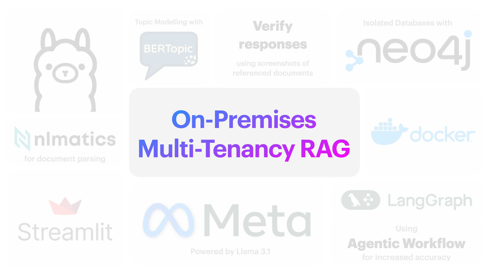
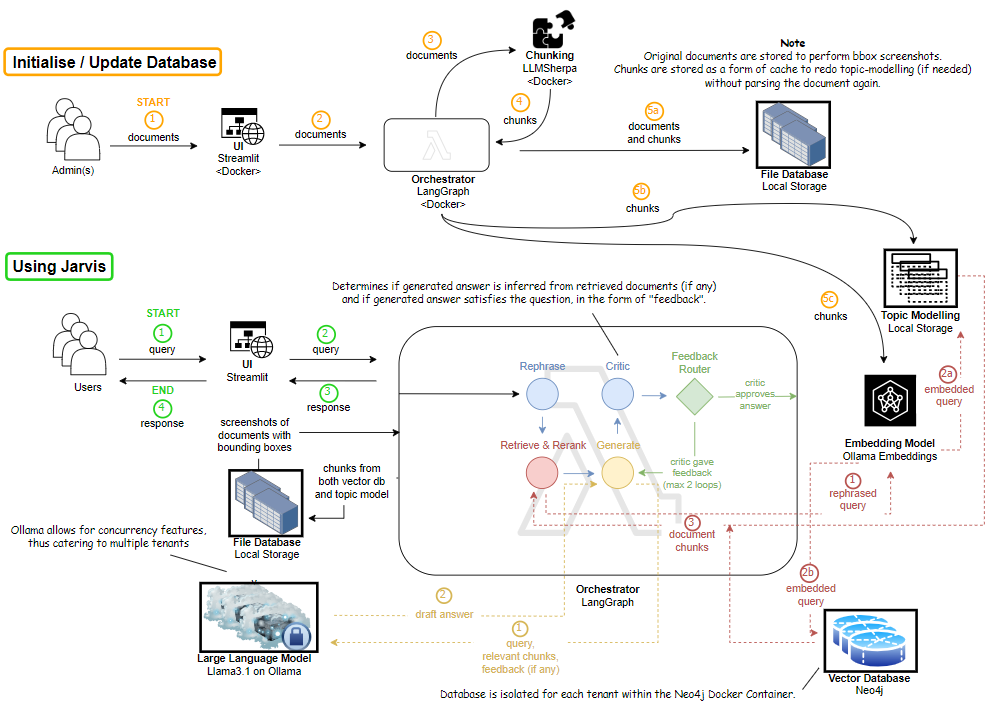

<a id="readme-top"></a>


<!-- PROJECT SHIELDS -->
[![Contributors][contributors-shield]][contributors-url]
[![Forks][forks-shield]][forks-url]
[![Stargazers][stars-shield]][stars-url]
[![Issues][issues-shield]][issues-url]
<!-- [![LinkedIn][linkedin-shield]][linkedin-url] -->


<!-- PROJECT LOGO -->
<br />
<div align="center">

  <div style="text-align: center;">
   <a>
      
   </a>
   </div>

<h3 align="center">On-Premises Multi-Tenancy Agentic RAG</h3>
  <p align="center">
    <em>your conservational assistant, powered by your documents</em>
    <!-- <br /><br/> -->
    <!-- <a href="https://github.com/jianyangg/local-llm"><strong>Explore the docs »</strong></a> -->
    <br />
    <br />
    <a href="https://github.com/jianyangg/local-llm">View Demo</a>
    ·
    <a href="https://github.com/jianyangg/local-llm/issues/new?labels=bug&template=bug-report---.md">Report Bug</a>
    ·
    <a href="https://github.com/jianyangg/local-llm/issues/new?labels=enhancement&template=feature-request---.md">Request Feature</a>
  </p>
</div>

# Contents

<details>
  <summary><em>Click to expand</em></summary>
  <ol>
    <li>
      <a href="#about">About</a>
      <ul>
        <li><a href="#what-makes-this-different-from-other-rag-projects">What makes this different from other RAG projects?</a></li>
        <li><a href="#demo">Demo</a></li>
        <li><a href="#architecture">Architecture</a></li>
        <li><a href="#built-with">Built With</a></li>
      </ul>
    </li>
    <li>
      <a href="#getting-started">Getting Started</a>
      <ul>
        <li><a href="#prerequisites">Prerequisites</a></li>
        <li><a href="#installation">Installation</a></li>
      </ul>
    </li>
    <li><a href="#usage">Usage</a></li>
    <li><a href="#customisations">Customisations</a></li>
    <li><a href="#roadmap">Roadmap</a></li>
    <li><a href="#contributing">Contributing</a></li>
    <li><a href="#contact">Contact</a></li>
    <li><a href="#acknowledgments">Acknowledgments</a></li>
  </ol>
</details>

<br>

# About

Skip to [Getting Started](#getting-started) if you are already familiar with the project.

<!-- ABOUT THE PROJECT -->
## What makes this different from other RAG projects?
<div style="text-align: center;">
   <a>
      
   </a>
</div>

* A proof of concept for improved RAG performance with
   * Topic Modelling
   * Agentic Workflow
* Scalable and easily hosted on any sufficiently powerful computer
* Simple platform to edit and build upon    

<!-- 
Here's a blank template to get started: To avoid retyping too much info. Do a search and replace with your text editor for the following: `jianyangg`, `local-llm`, `twitter_handle`, `linkedin_username`, `email_client`, `email`, `On-Premises Multi-Tenancy Agentic RAG`, `your conservational assistant, powered by your documents` -->

<p align="right">(<a href="#readme-top">back to top</a>)</p>

## Demo
_Coming up_

<p align="right">(<a href="#readme-top">back to top</a>)</p>

## Architecture
<div style="text-align: center;">
   <a>
      
   </a>
</div>

* This architecture is designed to achieve multi-tenancy on-premises, using isolated databases in `Neo4j` and concurrent instances of `Ollama` running Meta's `Llama 3.1`.
* **Note:** The two orchestrators are actually one, but separated for visibility sake.

<p align="right">(<a href="#readme-top">back to top</a>)</p>

## Built With

[![LangGraph][LangGraph.icon]][LangGraph.url] [![Ollama][Ollama.icon]][Ollama.url] [![Streamlit][Streamlit.icon]][Streamlit.url] [![Llama3.1][Llama3.icon]][Llama3.url] [![Docker][Docker.icon]][Docker.url] [![Neo4j][Neo4j.icon]][Neo4j.url] [![BERTopic][BERTopic.icon]][BERTopic.url]

<p align="right">(<a href="#readme-top">back to top</a>)</p>

<!-- GETTING STARTED -->
# Getting Started

## Installation (Docker)
> **Step 0** - You need to have Docker Desktop or equivalent [installed](https://docs.docker.com/get-docker/).

> **Step 1** - Clone the repo and navigate to the `streamlit-ui` directory.
>```bash
>git clone https://github.com/jianyangg/local-llm.git
>cd local-llm/streamlit-ui
>```

> **Step 2** - Build the Docker image.
>```docker
>docker-compose -p whateverStackNameYouWant up --build
>```

> **Step 3** - Open `localhost:8501` on your browser to access the Streamlit page.

## Installation (Local)

> **Step 0** - You need to have Docker Desktop or equivalent [installed](https://docs.docker.com/get-docker/). You also need to install the libraries specified in the `requirements.txt` files. There are two such files, one in the `jarvis-ui` directory and the other in the `orchestrator` directory.

> **Step 1** - Clone the repo and navigate to the `streamlit-ui` directory.
>```bash
>git clone https://github.com/jianyangg/local-llm.git
>cd local-llm/streamlit-ui
>```

> **Step 2** - Initialise the docker containers.
>### <span style="color: #3498db;">nlm-ingestor</span>
>```docker
>docker run -d -p 5001:5001 ghcr.io/nlmatics/nlm-ingestor:latest
>```
>### <span style="color: #3498db;">neo4j</span>
>```docker
>docker run -d --publish=7474:7474 --publish=7687:7687 --volume=$HOME/neo4j/data:/data neo4j
>```
>### <span style="color: #3498db;">ollama</span>
>```docker
>docker run -d --gpus=all -v ollama:/root/.ollama -p 11434:11434 -e OLLAMA_NUM_PARALLEL=4 --name ollama ollama/ollama
>```


> **Step 3** - Run the following commands in separate terminals:
>   - `streamlit run jarvis-ui/jarvis.py`
>   - `python orchestrator/api.py`
>

> **Step 4** - Open `localhost:8501` on your browser to access the Streamlit page.

<p align="right">(<a href="#readme-top">back to top</a>)</p>

<!-- USAGE EXAMPLES -->
# Usage

## Home Page
1. Select the **chat mode** you want to use from the dropdown menu in the sidebar.

   **Note:** You can switch between the two modes at any time.
   <details>
      <summary><strong>&emsp;Jarvis</strong></summary>
      <p>
      <blockquote>
      <p><em>&emsp;<strong>The flagship.</strong> This mode employs the agentic workflow discusses in the <a href="#architecture">architecture</a> earlier.</em></p>
      <p><em>&emsp;<strong>Caveat:</strong> While this mode provides the best retrieval and answer generation performance, it is also the most computationally and time intensive.</em></p>
   </details>
      <details>
      <summary><strong>&emsp;Semantic Search w/o Agents</strong></summary>
      <p>
      <blockquote>
      <p><em>&emsp;This mode presents the <strong>standard RAG</strong> architecture.</em></p>
      <p><em>&emsp;<strong>Caveat:</strong> While this mode may be considerably faster relative to Jarvis chat mode, the retrieval and answer generation performanace will be less optimal.</em></p>
   </details>
   <details>
      <summary><strong>&emsp;Chatbot</strong></summary>
      <p>
      <blockquote>
      <p>&emsp;<em>A Meta Llama3.1 instance.</em></p>
   </details><br>

1. If you are looking to **continue a past conversation**, select the conversation title of interest from the dropdown menu in the sidebar.

<p align="right">(<a href="#readme-top">back to top</a>)</p>

## File Uploader Page

1. Click the **Upload Files** button and select the files you want to upload.

1. A successful green box stating **File uploaded.** will appear at the bottom of the page to confirm the upload.
   
   Reupload the same file if this is not seen.


<p align="right">(<a href="#readme-top">back to top</a>)</p>

## Topics Page

1. Click the **Generate Topics** button to generate topics from the uploaded files.

   If topics have previously been generated, the button will reflect **Regenerate Topics** instead.

   <details>
   <summary><strong>Tips</strong></summary>
   This process is computationally and time intensive. Uploading of documents in the **File Uploader Page** will not automatically trigger this process. The advice is to batch process the documents once in a while to generate topics, so as to avoid unnecessary computational load.
   </details><br>

1. There are two tabs available. One displaying a **table of topic details** and the other displaying a **network graph** for visualisation of the topics.

   Both are interactive.

<!-- _For more examples, please refer to the [Documentation](https://example.com)_ -->

<p align="right">(<a href="#readme-top">back to top</a>)</p>

# Customisations

## Ollama

*You can customise the number of parallel instances of Ollama running on your machine.*
   * Change the `OLLAMA_NUM_PARALLEL` environment variable in the `docker-compose.yml` file.
   * However, this is limited by the computational power of your machine.

## Large Language Model 

*You can customise the language model used by Ollama.*

   1. Replace [![Llama3.1][Llama3.icon]][Llama3.url] in `ollama pull llama3.1` line in the `local-llm/streamlit-ui/ollama_entrypoint.sh` file to any other model name offered by Ollama (ensure the model can be run on your machine).
   1. Update the `llm_name` in the `app_config.py` file in the `streamlit-ui/jarvis-ui` and `streamlit-ui/orchestrator` directories.
   * The default is Meta's [![Llama3.1][Llama3.icon]][Llama3.url].

<p align="right">(<a href="#readme-top">back to top</a>)</p>

<!-- ROADMAP -->
# Roadmap

- [ ] Delete files
- [ ] Further code refactoring due to repetition instances

See the [open issues](https://github.com/jianyangg/local-llm/issues) for a full list of proposed features (and known issues).

<p align="right">(<a href="#readme-top">back to top</a>)</p>


<!-- CONTRIBUTING -->
# Contributing

Contributions are what make the open source community such an amazing place to learn, inspire, and create. Any contributions you make are **greatly appreciated**.

If you have a suggestion that would make this better, please fork the repo and create a pull request. You can also simply open an issue with the tag "enhancement".
Don't forget to give the project a star! Thanks again!

1. Fork the Project
2. Create your Feature Branch (`git checkout -b feature/AmazingFeature`)
3. Commit your Changes (`git commit -m 'Add some AmazingFeature'`)
4. Push to the Branch (`git push origin feature/AmazingFeature`)
5. Open a Pull Request

<p align="right">(<a href="#readme-top">back to top</a>)</p>


<!-- CONTACT -->
# Contact

**Project Link:** [local-llm](https://github.com/jianyangg/local-llm)

**Github:** [jianyangg](https://github.com/jianyangg)

<p align="right">(<a href="#readme-top">back to top</a>)</p>


<!-- ACKNOWLEDGMENTS -->
# Acknowledgments

* [Mentor - Han Ching](https://github.com/hanchingyong)
* []()
* []()

<p align="right">(<a href="#readme-top">back to top</a>)</p>


<!-- MARKDOWN LINKS & IMAGES -->
<!-- https://www.markdownguide.org/basic-syntax/#reference-style-links -->
[contributors-shield]: https://img.shields.io/github/contributors/jianyangg/local-llm.svg?style=for-the-badge
[contributors-url]: https://github.com/jianyangg/local-llm/graphs/contributors
[forks-shield]: https://img.shields.io/github/forks/jianyangg/local-llm.svg?style=for-the-badge
[forks-url]: https://github.com/jianyangg/local-llm/network/members
[stars-shield]: https://img.shields.io/github/stars/jianyangg/local-llm.svg?style=for-the-badge
[stars-url]: https://github.com/jianyangg/local-llm/stargazers
[issues-shield]: https://img.shields.io/github/issues/jianyangg/local-llm.svg?style=for-the-badge
[issues-url]: https://github.com/jianyangg/local-llm/issues
[license-shield]: https://img.shields.io/github/license/jianyangg/local-llm.svg?style=for-the-badge
[license-url]: https://github.com/jianyangg/local-llm/blob/master/LICENSE.txt
<!-- [linkedin-shield]: https://img.shields.io/badge/-LinkedIn-black.svg?style=for-the-badge&logo=linkedin&colorB=555
[linkedin-url]: https://linkedin.com/in/linkedin_username -->
[product-screenshot]: images/screenshot.png

[LangGraph.icon]: https://img.shields.io/badge/LangGraph-1C3C3C?style=for-the-badge&logo=langchain&logoColor=FFFFFF
[LangGraph.url]: https://langchain-ai.github.io/langgraph/

[Ollama.icon]: https://img.shields.io/badge/Ollama-FFFFFF?style=for-the-badge&logo=NONE&logoColor=000000
[Ollama.url]: https://ollama.com

[BERTopic.icon]: https://img.shields.io/badge/BERTopic-1C3C3C?style=for-the-badge&logo=bert&logoColor=FFFFFF
[BERTopic.url]: https://maartengr.github.io/BERTopic/

[Streamlit.icon]: https://img.shields.io/badge/Streamlit-FF4B4B?style=for-the-badge&logo=streamlit&logoColor=FFFFFF
[Streamlit.url]: https://streamlit.io

[Llama3.icon]: https://img.shields.io/badge/Llama-3.1-5ec8de?style=for-the-badge&logo=meta&logoColor=FFFFFF
[Llama3.url]: https://ai.meta.com/blog/meta-llama-3-1/

[Docker.icon]: https://img.shields.io/badge/Docker-2496ED?style=for-the-badge&logo=docker&logoColor=FFFFFF
[Docker.url]: https://www.docker.com

[Neo4j.icon]: https://img.shields.io/badge/Neo4j-008CC1?style=for-the-badge&logo=neo4j&logoColor=FFFFFF
[Neo4j.url]: https://neo4j.com

<!-- # local-llm

## Demo (without using Docker Compose)

1. Get the docker containers for the llm and neo4j database running and exposed to relevant ports.
   - nlm-ingestor: `docker run -p 5001:5001 ghcr.io/nlmatics/nlm-ingestor:latest`
   - llm: Download Ollama locally or `docker run -d --gpus=all -v ollama:/root/.ollama -p 11434:11434 -e OLLAMA_NUM_PARALLEL=4 --name ollama ollama/ollama` as per this [tutorial](https://hub.docker.com/r/ollama/ollama).
   - neo4j: `docker run --publish=7474:7474 --publish=7687:7687 --volume=$HOME/neo4j/data:/data neo4j`

2. Run the following commands in separate terminals:
   - `streamlit run streamlit-ui/jarvis-ui/jarvis.py`
   - `python streamlit-ui/orchestrator/api.py`

   Then, open `localhost:8501` on your browser to access the Streamlit page.

Documentation is a work-in-progress. -->
